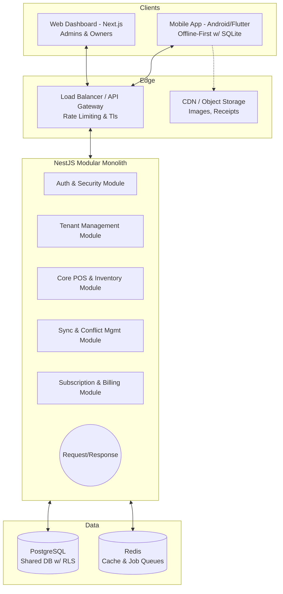

# Infinity SaaS Platform - Architecture & System Design
Designed by Antigravity - Senior Software Architect

## 1. High-Level Architecture

The Infinity platform relies on a **Modular Monolith** architecture for the MVP, which allows rapid development and easy deployment while keeping namespaces and domains strictly separated for a future microservices extraction.



---

## 2. Multi-Tenant Strategy

### Strategy Comparison

| Approach | Architecture | Security Isolation | Complexity | Performance | Cost |
| :--- | :--- | :--- | :--- | :--- | :--- |
| **Separate DB per Tenant** | Database per tenant | Highest | High | High | High |
| **Shared DB, Separate Schema** | Schema per tenant | High | Medium | Medium | Medium |
| **Shared DB, Shared Schema** | `tenant_id` column limit | Medium (Needs RLS) | Low | High | Low |

### Recommendation for Infinity: **Shared DB with Row-Level Security (RLS)**
For an MVP scaling up to 10,000 tenants, the **Shared Database with Shared Schema** is the absolute best approach. We strictly enforce data isolation at the database level using **PostgreSQL Row-Level Security (RLS)**. 
- **Security**: Even if a developer writes a bad query `SELECT * FROM products;`, Postgres will physically prevent returning rows that do not match the current connection's `app.current_tenant_id`.
- **Scaling**: If an "Enterprise" tenant outgrows the shared DB, we can migrate them to a dedicated database later (Hybrid Approach) with routing at the API Gateway.

---

## 3. Database Schema (PostgreSQL)

> [!IMPORTANT]
> **Perfect Database Foundation:** Every table relies on `tenant_id` for isolation. Soft-deletes (`deleted_at`) and modification tracking (`updated_at`) are critical to enable offline sync capabilities.

```sql
-- 1. Tenants & Infrastructure
CREATE TABLE tenants (
    id UUID PRIMARY KEY DEFAULT gen_random_uuid(),
    name VARCHAR(255) NOT NULL,
    status VARCHAR(50) DEFAULT 'ACTIVE',
    subscription_plan VARCHAR(50) DEFAULT 'BASIC',
    created_at TIMESTAMP WITH TIME ZONE DEFAULT NOW(),
    updated_at TIMESTAMP WITH TIME ZONE DEFAULT NOW()
);

-- RLS Enforcement (Example applied to all tables)
-- ALTER TABLE products ENABLE ROW LEVEL SECURITY;
-- CREATE POLICY tenant_isolation ON products USING (tenant_id = current_setting('app.current_tenant_id')::UUID);

CREATE TABLE branches (
    id UUID PRIMARY KEY DEFAULT gen_random_uuid(),
    tenant_id UUID REFERENCES tenants(id) ON DELETE CASCADE,
    name VARCHAR(255) NOT NULL,
    created_at TIMESTAMP WITH TIME ZONE DEFAULT NOW(),
    updated_at TIMESTAMP WITH TIME ZONE DEFAULT NOW(),
    deleted_at TIMESTAMP WITH TIME ZONE
);

CREATE TABLE users (
    id UUID PRIMARY KEY DEFAULT gen_random_uuid(),
    tenant_id UUID REFERENCES tenants(id) ON DELETE CASCADE,
    email VARCHAR(255) UNIQUE NOT NULL,
    password_hash VARCHAR(255) NOT NULL,
    role VARCHAR(50) NOT NULL, -- SUPER_ADMIN, OWNER, STAFF
    created_at TIMESTAMP WITH TIME ZONE DEFAULT NOW(),
    updated_at TIMESTAMP WITH TIME ZONE DEFAULT NOW(),
    deleted_at TIMESTAMP WITH TIME ZONE
);

-- 2. Core POS Modules
CREATE TABLE products (
    id UUID PRIMARY KEY, -- Client-generated UUID to support offline creation
    tenant_id UUID REFERENCES tenants(id) ON DELETE CASCADE,
    name VARCHAR(255) NOT NULL,
    sku VARCHAR(100),
    barcode VARCHAR(100),
    price DECIMAL(10, 2) NOT NULL,
    cost DECIMAL(10, 2),
    created_at TIMESTAMP WITH TIME ZONE DEFAULT NOW(),
    updated_at TIMESTAMP WITH TIME ZONE DEFAULT NOW(),
    deleted_at TIMESTAMP WITH TIME ZONE
);

CREATE TABLE inventory (
    id UUID PRIMARY KEY DEFAULT gen_random_uuid(),
    tenant_id UUID REFERENCES tenants(id) ON DELETE CASCADE,
    branch_id UUID REFERENCES branches(id) ON DELETE CASCADE,
    product_id UUID REFERENCES products(id) ON DELETE CASCADE,
    quantity INT NOT NULL DEFAULT 0,
    updated_at TIMESTAMP WITH TIME ZONE DEFAULT NOW()
);

-- 3. Transactions & Sync Logs
CREATE TABLE transactions (
    id UUID PRIMARY KEY, -- Mapped to Client-generated Idempotency Key
    tenant_id UUID REFERENCES tenants(id) ON DELETE CASCADE,
    branch_id UUID REFERENCES branches(id) ON DELETE CASCADE,
    user_id UUID REFERENCES users(id),
    total_amount DECIMAL(10, 2) NOT NULL,
    payment_method VARCHAR(50), 
    status VARCHAR(50) DEFAULT 'COMPLETED',
    client_created_at TIMESTAMP WITH TIME ZONE NOT NULL, -- Crucial for true offline ordering
    server_synced_at TIMESTAMP WITH TIME ZONE DEFAULT NOW()
);

CREATE TABLE transaction_items (
    id UUID PRIMARY KEY,
    transaction_id UUID REFERENCES transactions(id) ON DELETE CASCADE,
    product_id UUID REFERENCES products(id),
    quantity INT NOT NULL,
    unit_price DECIMAL(10, 2) NOT NULL,
    subtotal DECIMAL(10, 2) NOT NULL
);
```

---

## 4. Offline Sync Model (CRITICAL)

The sync model relies on **Idempotency** and **Eventual Consistency**.

### Client-Side Database Design (SQLite/Room)
- `AppDatabase`: Mirrors the server structure.
- `OutboxQueue`: A table acting as a local transaction log. All modifications run through this outbox when offline.
- `last_sycned_at`: Tracks the latest timestamp received from the server.

### Step-by-Step Sync Flow

**A. Push Flow (Client -> Server)** - Used for transferring offline actions.
1. **Offline Action**: Staff makes a sale. The app creates a transaction using a newly generated UUID `tx-999`. 
2. **Local Commit**: It saves the transaction to SQLite. It simultaneously inserts an event into the local `OutboxQueue`: `{"id": "event-1", "action": "CREATE_TX", "entity_id": "tx-999", "payload": {...}}`.
3. **Network Restored**: App detects internet. Calls push endpoint `POST /api/sync/push`.
4. **Server Processing**: Server loops over events. It uses `entity_id` as the **Idempotency Key**. If `tx-999` is already in the Postgres DB, it skips it (handling duplicate retries). If new, it inserts.
5. **Inventory Deductions**: Server computes `inventory = inventory - quantity` transactionally.
6. **Acknowledge**: Server returns successful `event_id`s. Client deletes those from `OutboxQueue`.

**B. Pull Flow (Server -> Client)** - Used for maintaining up-to-date products/inventory.
1. **Pull Request**: Client calls `GET /api/sync/pull?timestamp=1690000000` (`last_synced_at`).
2. **Delta Query**: Server queries all tables (Products, Inventory, Users) for `updated_at > 1690000000` AND `tenant_id == User's Tenant`.
3. **Response**: Server sends a JSON payload with entity lists: `{"products": [...], "deleted_products": [...]}`. (Deleted entities are found via `deleted_at > timestamp`).
4. **Client Merge**: Client upserts data into SQLite using **Last-Write-Wins (LWW)** conflict resolution based on timestamps. Server is ALWAYS the source of truth for Products/Inventory.

---

## 5. API Structure

The API heavily utilizes JWTs containing `tenant_id`, `branch_id`, and `role` to route and secure data implicitly.

### Sync Endpoints
- `POST /api/v1/sync/push`
  - Body: `{ "client_id": "dev-123", "events": [ { "type": "TX_CREATE", "payload": ... } ] }`
  - Returns: `{ "processed_events": ["event-01", "event-02"], "failed_events": [] }`
- `GET /api/v1/sync/pull?since={timestamp}`
  - Returns: `{ "server_time": 1718000000, "data": { "products": [], "inventory": [] } }`

### Core Endpoints
- `POST /api/v1/pos/transactions` (Real-time pos checkout if online)
- `GET /api/v1/inventory?branch_id=UUID`
- `POST /api/v1/products`

### Tenant Management
- `POST /api/v1/auth/register` (Registers new tenant + owner user)
- `GET /api/v1/admin/reports/sales` (Aggr. reports based on `user.tenant_id`)

---

## 6. Component Breakdown

To enable a pluggable architecture, the monolith is divided logically into Domain modules:

1. **Auth & Setup Service**: Handles user sessions, JWTs, BCrypt hashing.
2. **Tenant Service**: Manages global configuration for a tenant, Subscription Tier lookups, and branch management.
3. **Sync Engine Service**: Pure logic gate for idempotency processing, delta generation, and conflict resolution rules.
4. **Product & POS Service (Module A)**: Inventory tracking, product catalogs. 
5. **Rental Service (Module B)**: Tracks assets out on rent, return dates, late fees. Loosely coupled to the POS service where rentals hit the transaction ledger.
6. **Reporting Service**: Heavy read-only operations, separated to allow caching using Redis.

---

## 7. Tech Stack Justification

| Layer | Technology | Justification |
| :--- | :--- | :--- |
| **Backend** | Node.js with **NestJS** | Typescript provides end-to-end type safety between Mobile (React Native) / Web and Backend. NestJS enforces modular architecture out-of-the-box (Modules, Providers) which strictly prevents tight-coupling, making a microservice transition later trivially easy. |
| **Database** | **PostgreSQL** | Best-in-class relational database. Its native JSONB support handles dynamic payloads, and built-in **Row-Level Security (RLS)** provides enterprise-grade tenant isolation. |
| **Caching** | **Redis** | In-memory store needed for request rate limiting, JWT blocklisting, and processing large background reporting jobs (via BullMQ). |
| **Frontend** | **Next.js (Web) / Flutter or Kotlin (Mobile)** | Next.js offers SEO & fast performance for admin dashboards. Flutter is ideal for writing single Android/iOS offline-first codebase utilizing local Hive or SQLite. |
| **Cloud Infra** | AWS Docker (Fargate) | Run NestJS as stateless docker instances. Easily autoscale the API fleet from 10 to 10,000 tenants behind an ALB (Application Load Balancer). |

---

## 8. Scan-Driven POS System (PRIMARY INTERACTION MODEL)

The POS system prioritizes a **scan-driven** workflow to ensure minimal user interaction, ultra-high speed, and robust offline reliability. 

### Core Behavior & UX
- **Scan as Primary Input:** Scanning a barcode automatically looks up the product and adds it to the cart. Scanning the same barcode multiple times increments the quantity.
- **Dead-Simple UI:** Large product displays post-scan, minimal taps required to checkout, and clear audio/visual indicators (beep on success, buzz/red flash on error).
- **Responsive Performance:** Scan-to-response time is guaranteed **< 200ms**, powered by an optimized, heavily indexed local SQLite/Room database.

### Dynamic Scan Modes
- **🛒 Sales Mode (Default):** Adds scanned item to the current checkout cart.
- **↩️ Return Mode:** Scans process a return, deducting from daily sales and adding back to available local inventory.
- **📦 Inventory Count Mode:** Audits current stock levels. Scanned items increment the "counted" tally instead of ringing up a sale.

### Hardware & Fallbacks
- **Supported Hardware:** 
  - External Bluetooth barcode scanners / Scan Guns (recommended for speed/ergonomics).
  - Built-in device camera (supported but secondary).
- **Graceful Fallbacks (Crucial for real-world scenarios):**
  - If a barcode is missing, unreadable, or slow to capture: **Manual product search** via text.
  - Quick-access **Favorites** / common items grid for non-barcoded items.
  - Easy manual quantity adjustment (avoid scanning an item 50 times).
  - If an item doesn't exist, provide a 1-tap "Quick Create Product" flow (Owner role only).

### Advanced Features
- **Auto Checkout Mode (Toggle):** A configuration where scanning an item immediately triggers payment completion (ideal for fast-paced 1-item queues).
- Integral offline sync: Every scan transaction is instantly recorded locally and pushed via the robust outbox model. The offline-sync architecture ensures that a weak connection never interrupts the scan flow.

---

## 9. Storefront CCTV Integration

As a critical tool for remote franchise owners, the Web Analytics Dashboard integrates real-time CCTV monitoring. This allows business owners to maintain a physical presence and verify live POS activity against storefront camera feeds directly from the cloud.

### Infrastructure & Streaming
- **Hardware Integration:** Supports standard IP cameras (RTSP streaming) installed at the branch physical locations.
- **Edge Processing:** A lightweight local daemon runs at the branch to transcode native RTSP feeds into WebRTC or HLS streams for low-latency web viewing.
- **Dashboard Access:** The Web Admin Dashboard embeds a native `<video>` or WebRTC player, securely pulling the stream via the cloud API gateway.
- **Security:** Feeds are strictly secured via JWT. Only users with the `OWNER` role can access the remote live feed.

---

## 10. MVP Scope vs Future Expansion

### MVP Scope (Months 1-3)
- Fully functional POS System.
- Branch management (1 default branch, switchable).
- True Offline-First Android app (Transactions & Product pull).
- Shared PostgreSQL database utilizing strict RLS.
- Basic Reporting (Sales by Day/Item).

### Future Expansion (Months 4+)
- **Pluggable Modules:** Activate Rental Engine or Service/Repair module for specific tenants.
- **Microservices Extraction:** If the "Reporting Service" consumes too many server bounds, split it from NestJS into a dedicated read-replica microservice.
- **Auto-Sync:** Background Sync API utilizing WebSockets or FCM to silently push changes while the app is backgrounded.
- **Enterprise DB Sharding:** Migrate high-volume tenants onto their own PostgreSQL clusters.
